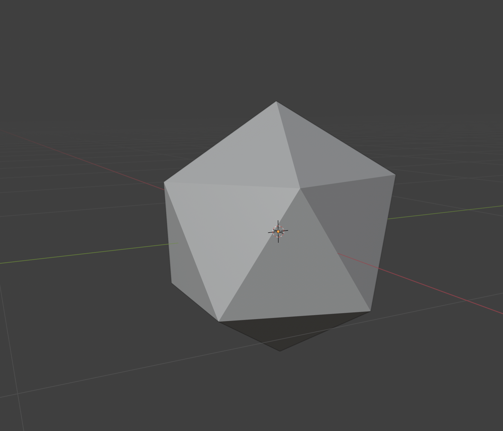
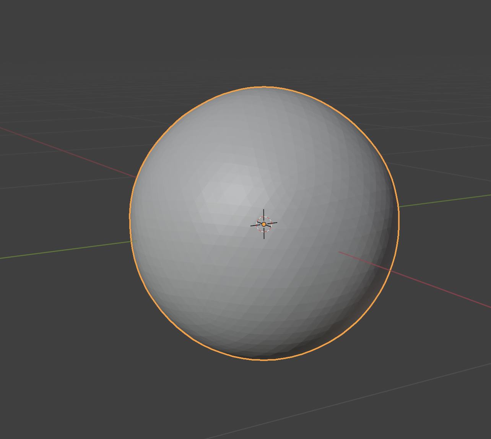
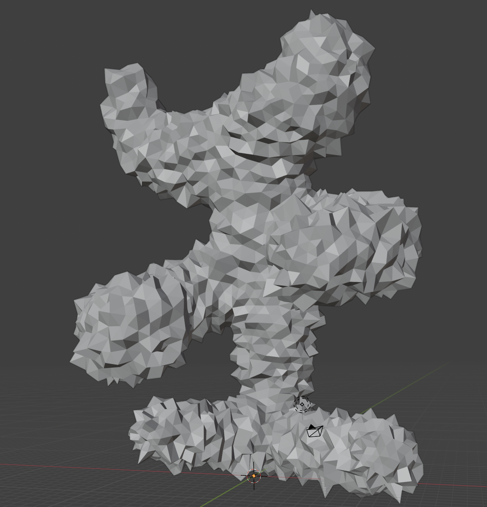
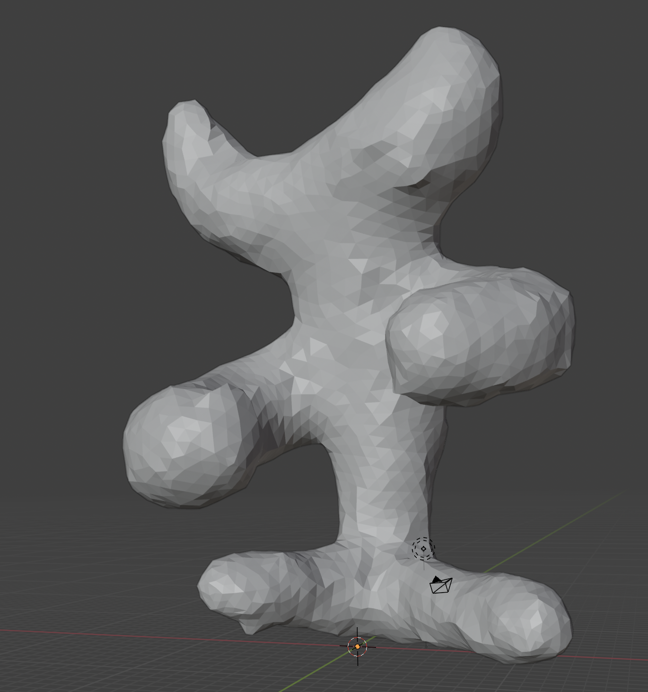

## Mesh (final submission)

### How to run

Run the program with a specified `.ini` config file. The program should automatically save the output mesh to the `student_outputs/final` folder. 

- For instance, after running the program with the `subdivide_icosahedron_4.ini` config file, go to and open `student_outputs/final/subdivide_icosahedron_4.obj`.

> Qt Creator users: If your program can't find certain files or you aren't seeing your output images appear, make sure to: 
>
> 1. Set your working directory to the project directory
> 2. Set the command-line argument in Qt Creator to `template_inis/final/<ini_file_name>.ini`

| Operation |                                   Before                                   |                                   After                                   |
| :---------------------------: | :------------------------------------------------------------------------: | :-----------------------------------------------------------------------: |
|  Loop Subdivision  |  |  | 
|Bilateral Mesh Denoising| |  |

### Implementation Locations

Please list the lines where the implementations of these features start:

- [Mesh data structure & validator](mesh.cpp#L125)
- [Loop Subdivision](operations.cpp#L7)
- [Bilateral Mesh Denoising](operations.cpp#L120)

### Design Choices

#### Mesh Data Structure

My mesh data strucutre used only HalfEdges and Vertices. The list of faces is repopulated at the end to convert back to an obj by simply iterating through halfedge->next and halfedge->next->next to form a full triangle.

#### Mesh Validator

-check for nullptrs

-halfedges have different vertex from twin

-halfedge->twin->next has name vertex as halfedge

-halfedge = halfedge->next->next->next

-i have a degree int in my Vertex sturct so I make sure that I loop around all the connecting halfedges, and count the numver of iterations, it will equal my degree count

#### Run Time/Efficency

I never used any double for loops. Everything is made up of several linear functions. I also tried to use mostly vectors since they have better runtime in terms of iteration. 
